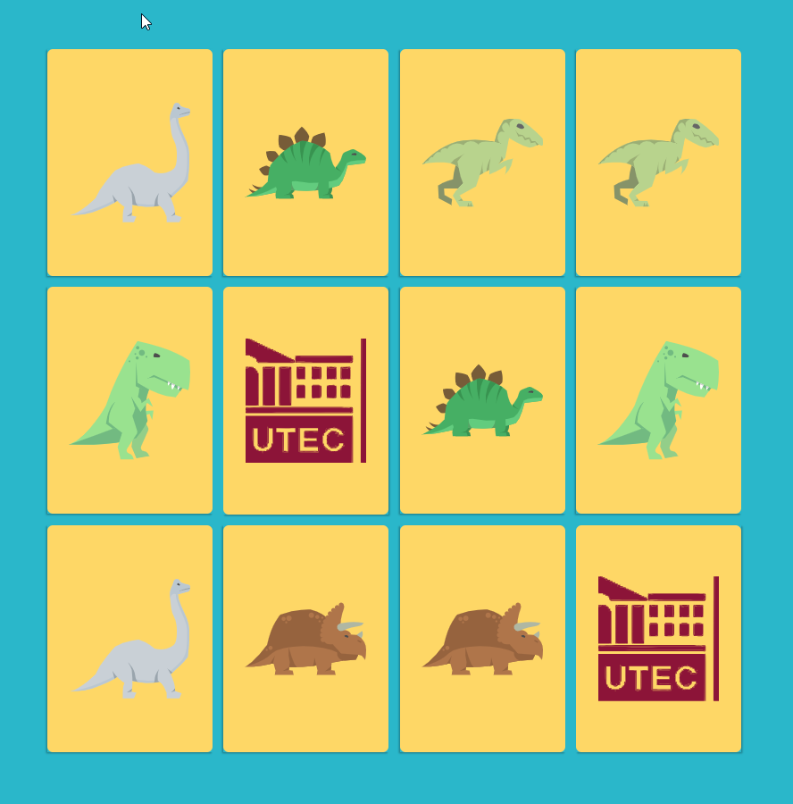

## memory_game
JS memory card game for kids.

I made this for an activity with my younger son's school (preschool). I had to go and talk with the class about my profesion, what do I do and how does it somehow relate to their everyday. It was a very fun thing to do and I used the game for keeping their attention and talking a little about programming.

It is a very simple implementation of HTML, JS and CSS concepts.

HTML: basic templating.
JS: working with arrays and strings.
CSS: basic styling, selectors, transormations, display, among others.

